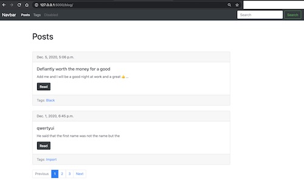
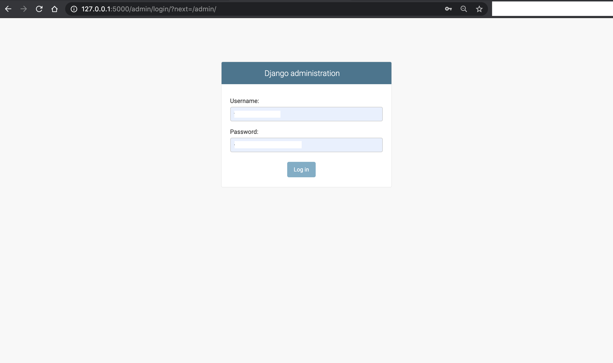
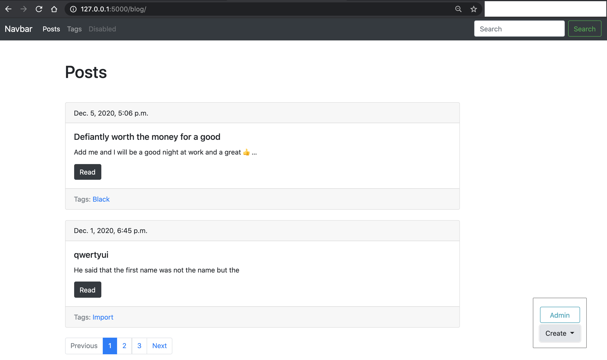
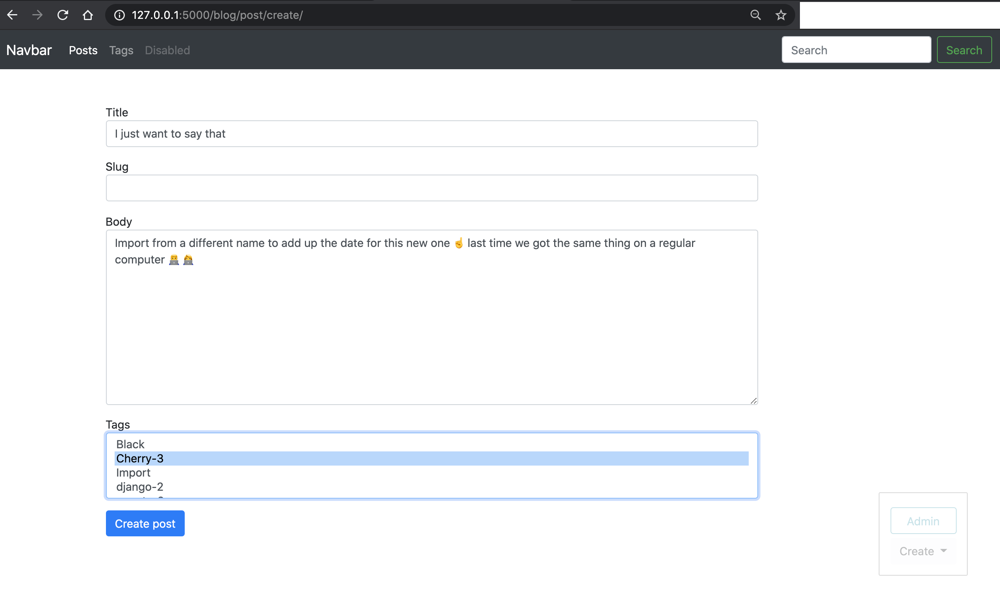
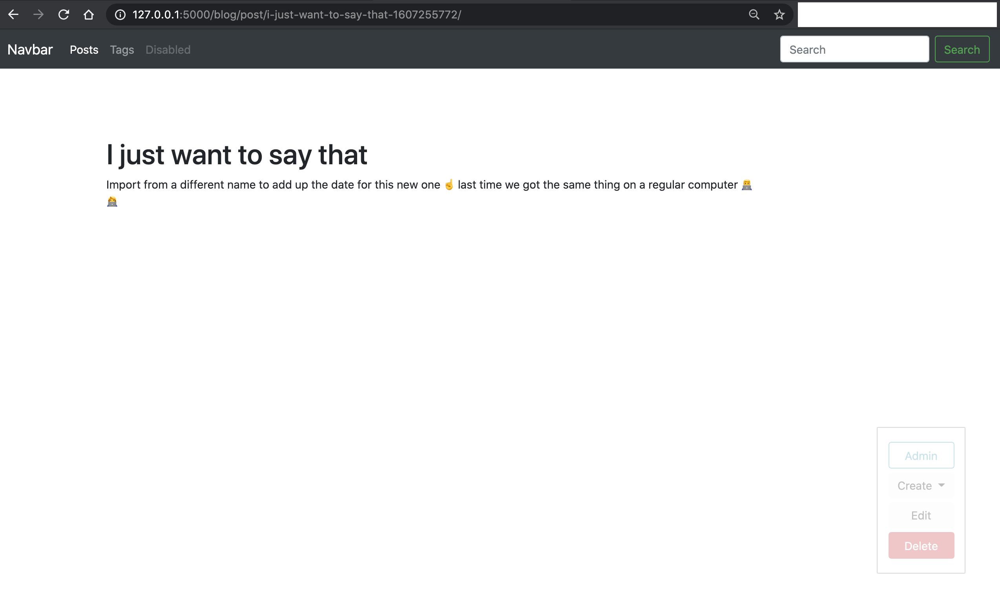
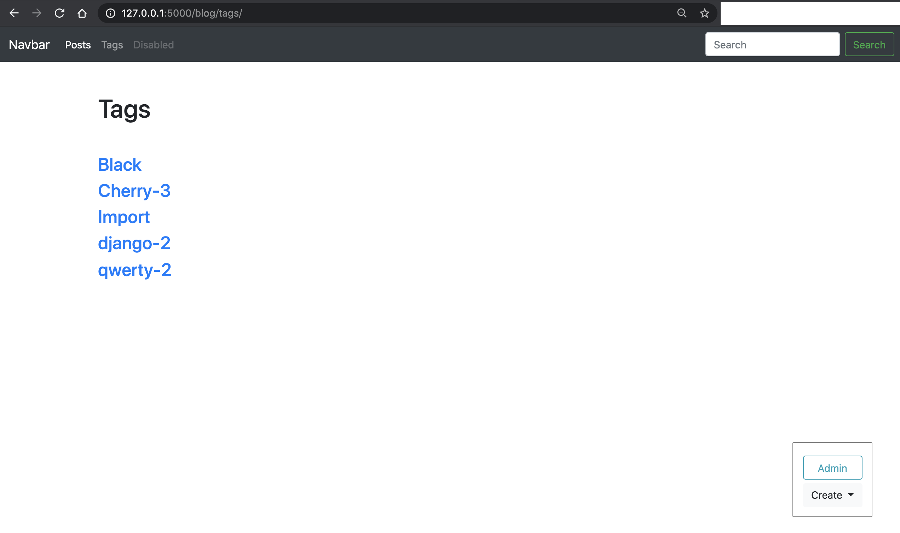
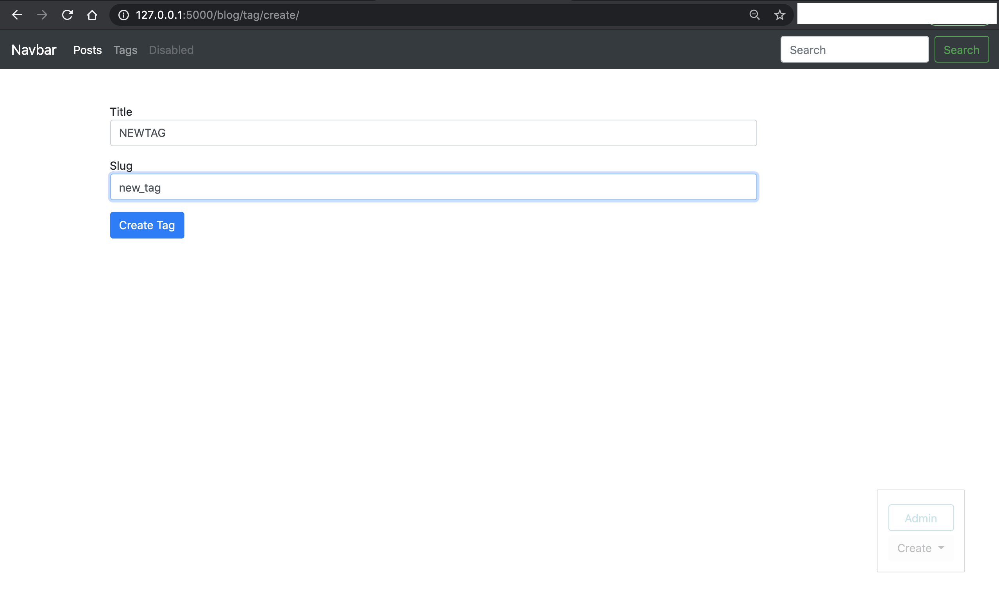

#Simple Django Blog

On this blog you can create posts, and tags if you have admin rights, if not, you can just read posts.

#####Lets try create a post

Firstable, we must log in as admin

Afterwards the admin panel is appear

Now, Create=>Post, and we can fill the forms.

Slug field can be empty, in this case slug will be created automatically

Our post was created

Also we have a tags list.

And can create new tag.

Thanks for your time :)
P.S. and sorry for horrible english